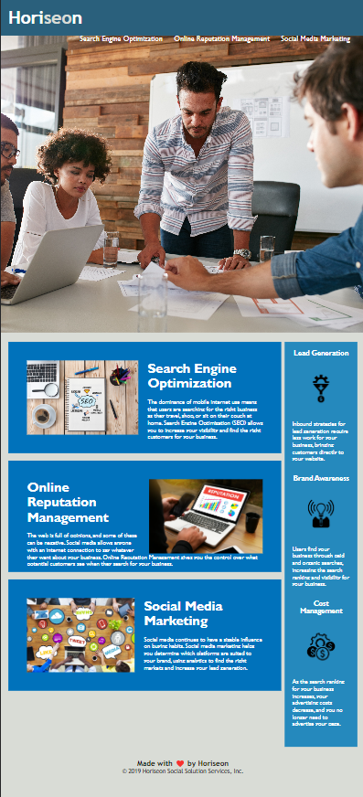

#Challenge-Horiseon

##Description

In this bootcamp challenge, students were tasked with copying the HTML code provided, and consolidating and organizing the CSS selectors and properties to follow semantic struscture.
Through the challenge, students learned how to commit with clear and concise messages, alternate ways in consolidating CSS selectors and properties, as well as deployment.
The finished product will resemeble at least 90% of the screenshot mockup that was provided.

##Usage

Copy and past the link in the address bar.
You will be able to click on the links, located on the upper right hand corner of the webpage, and be directed to its corresponding section.
The webpage will looks similar to the screenshot:

##Credits

The UTA Bootcamp provided the HTML and CSS codes, as well as images, for this project.

##License
